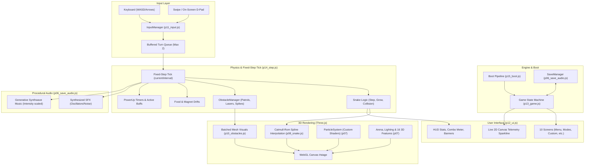
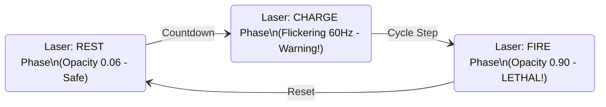

# 🐍 NEURAL SNAKE 3D — Complete Architecture & Feature Guide
> **"Three-Dimensional Grid Organism"** — Ek complete deep-dive documentation jo batati hai ki ye game start se leke end tak kaise kaam karta hai, iska har feature parde ke peeche (under the hood) kaise execute hota hai.

---

## 📑 Table of Contents
1. [Project Overview — Ye Project Kya Hai?](#1-project-overview--ye-project-kya-hai)
2. [High-Level Architecture Diagram](#2-high-level-architecture-diagram)
3. [File Structure & Parts Breakdown](#3-file-structure--parts-breakdown)
4. [Startup & Boot Pipeline — Game Load Kaise Hota Hai?](#4-startup--boot-pipeline--game-load-kaise-hota-hai)
5. [3D Graphics & Rendering Engine (Three.js + Custom Shaders)](#5-3d-graphics--rendering-engine)
6. [Dual-Clock Game Loop & Fixed-Step Simulation](#6-dual-clock-game-loop--fixed-step-simulation)
7. [Snake Controller & Fluid Spline Animation](#7-snake-controller--fluid-spline-animation)
8. [Input System & Double-Tap Buffer](#8-input-system--double-tap-buffer)
9. [The 7 Game Modes (Classic, Time Attack, Endless, Survival, Challenge, Cyber Hunt, Versus 2P)](#9-the-7-game-modes)
10. [Hazards & Obstacle Management (6 Lethal Obstacles)](#10-hazards--obstacle-management)
11. [Food, Combos & 7 Super Power-Ups](#11-food-combos--7-super-power-ups)
12. [Procedural Web Audio Engine — Zero MP3 Files Synthesizer](#12-procedural-web-audio-engine)
13. [16 Custom 3D Arenas & Theming Engine](#13-16-custom-3d-arenas--theming-engine)
14. [Save System, Daily Challenges & 15 Achievements](#14-save-system-daily-challenges--15-achievements)
15. [UI System, Glassmorphism & Live Telemetry](#15-ui-system-glassmorphism--live-telemetry)
16. [Developer Console & Debugging APIs](#16-developer-console--debugging-apis)

---

## 1. Project Overview — Ye Project Kya Hai?

**NEURAL SNAKE 3D** ek ultra-modern, cyberpunk-themed 3D snake arcade game hai jisko web browsers ke liye banaya gaya hai. Ye traditional 2D Nokia snake game ka ek highly sophisticated next-generation evolution hai.

### 🌟 Key Highlights & Engineering Philosophy:
* **Single-File Architecture (`index.html`)**: Pura game bina kisi build tool ya bundler ke direct browser me chal sakta hai. Isme ek single external dependency hai: `Three.js (r128)` jo CDNs se load hoti hai.
* **Zero External Audio/Texture Files**: Game me ek bhi `.mp3`, `.wav`, `.png` ya `.jpg` file nahi hai! 
  * Sabhi textures HTML5 Canvas se procedurally generate hote hain.
  * Sara sound effect aur dynamic background synthwave music **Web Audio API** ke oscillators aur noise filters se real-time synthesize hota hai.
* **Fluid Interpolation (No Grid Snapping)**: Halaki game ka collision logic strictly ek $21 \times 21$ discrete grid par run karta hai, rendering ke liye **Catmull-Rom cubic splines** use kiye gaye hain. Snake ke turns ekdam soft, fluid aur organic lagte hain.
* **High Performance**: Zero Garbage-Collection allocations on runtime — particle pools, mesh pools aur food pools pre-allocated rehte hain taaki fast runs me bhi browser frame-drop na kare (solid 60 FPS).

---

## 2. High-Level Architecture Diagram

Neeche diye gaye diagram se samjhein ki project ke alag-alag modules aapas me kaise communicate karte hain:



---

## 3. File Structure & Parts Breakdown

Project folder me main single file `index.html` hai aur uske source components `parts/` directory me well-organized modules me divided hain:

| File Name | Size | Primary Responsibility (Kaam Kya Hai?) |
| :--- | :--- | :--- |
| `p01_head.html` | ~6 KB | HTML5 Doctype, SEO meta, Google Fonts (`Chakra Petch`, `JetBrains Mono`), CSS Design Tokens & Root Variables. |
| `p02_css.html` | ~8 KB | Global CSS, reset styles, Cyberpunk glassmorphism sheets, buttons, tabs, segment controls. |
| `p03_css.html` | ~16 KB | HUD styling, D-pad touch controls, powerup bars, combo visual meters, floating popups animation. |
| `p04_body.html` | ~18 KB | Complete DOM structure: 10 game screens, HUD overlay, WebGL fallback screen, and Three.js CDN loader. |
| `p05_core.js` | ~22 KB | Global constants ($21 \times 21$ grid), 9 Colors, 6 Skins, 16 Arenas, 7 Powers, 5 Modes, 15 Achievements, Math utilities. |
| `p06_save_audio.js` | ~19 KB | `SaveManager` (localStorage) + `Audio` (Pure Web Audio API synthesizer for 14 SFX + 4-bar procedural music). |
| `p07_particles_arena.js`| ~32 KB | `Assets` (Procedural geometries/textures), `ParticleSystem` (Custom vertex/frag points shader), `Arena` (Floor, motes, 16 3D maps). |
| `p08_snake.js` | ~13 KB | `Snake` class: Catmull-Rom spline calculations, blinking eyes, target-food head tracking, jaw opening, ghost/shield effects. |
| `p09_food_power.js` | ~11 KB | `FoodManager` (pooled glowing cores, rare shards, magnet physics) + `PowerUpManager` (spawn weights & active durations). |
| `p10_obstacles.js` | ~23 KB | `ObstacleManager`: 6 hazard implementations (Block, Patrol, Laser, Spinner, Pad, Spike) + 12 handcrafted Challenge layouts. |
| `p11_input.js` | ~9 KB | `InputManager`: Dual-turn buffered input, swipe gestures, virtual d-pad, + 2D canvas telemetry chart drawer. |
| `p12_ui.js` | ~37 KB | `UIManager`: Screen transitions, HUD updates, DOM data binding, 3D-to-2D projected score popups, toast notifications. |
| `p13_game.js` | ~25 KB | `Game`: Main state machine, camera rig controller (chase camera, pitch, shake), attract/demo loop, scene management. |
| `p14_step.js` | ~23 KB | `Game.simulate`: Fixed-step grid tick, collision resolution, combo chain multipliers, level ups, multi-stage death sequence. |
| `p15_boot.js` | ~7 KB | `Boot`: 6-stage honest preloader, WebGL capability probe, window resize/orientation/visibility observers. |
| `p16_tail.html` | ~33 B | Module closure closing tags `})(); </script> </body> </html>`. |
| `qa/harness.js` | ~29 KB | Headless node test harness with mock DOM/Three.js/WebAudio to test game logic without a browser. |

---

## 4. Startup & Boot Pipeline — Game Load Kaise Hota Hai?

Game ka startup sequence `parts/p15_boot.js` me defined hai. Ye koi fake timer wala loading screen nahi hai; har stage actual heavyweight assets initialize karti hai:

```
[DOM Ready]
   │
   ├──> 1. SaveManager.load() (Reads localStorage, validates & cleans data)
   ├──> 2. UI.init() & Input.init() (Prepares DOM elements, binds global listeners)
   ├──> 3. Three.js CDN Check (Fallback mechanism: cdnjs -> jsdelivr -> unpkg)
   ├──> 4. WebGL Probe (Temporary canvas context creates & immediately destroys)
   │
   └──> [Staged Initialization Pipeline]:
        ├── 20%  : Game.initRenderer() & Game.initScene()
        ├── 38%  : Assets.init() (Compiles procedural geometries & canvas glow textures)
        ├── 58%  : Game.arena = new Arena() (Builds grid, perimeter walls, ambient motes)
        ├── 76%  : Game.initEntities() (Initializes Snake, Food, Powers, Obstacles, Particles)
        ├── 90%  : Camera calibration & Attract Demo mode setup
        └── 98%  : Warm-up render frame (Pre-warms GPU shaders to eliminate first-frame lag)
             │
             └──> [100% Ready] -> "PRESS ENTER / PLAY" button enables
```

> [!NOTE]
> **User-Gesture Audio Unlock**: Modern browsers autoplay policy ke mutabiq tab tak sound play nahi hone dete jab tak user interact na kare. Isliye game `Boot.enter()` button par user ke pehle click/tap par `AudioContext.resume()` trigger karta hai.

---

## 5. 3D Graphics & Rendering Engine

Game ka graphics engine Three.js standard rendering pipeline par built hai jisme custom optimizations add kiye gaye hain:

### A. Camera Rig (Fixed-Heading Chase Camera)
* Snake ke ghoomne par camera 360-degree spin **nahi** karta, jisse player ko motion-sickness ya disorientation na ho.
* Camera ek fixed heading se snake ke head ko smoothly chase karta hai with lerping (`easeOutCubic`).
* **Settings me 3 Camera Distances**: `Close` (FOV 60°), `Normal` (FOV 54°), aur `Far` (FOV 48°).
* **Screen Shake Engine**: Jab snake hurt hota hai, level up hota hai ya rare food khata hai, camera coordinates me sinusoidal damping shake add hota hai.

### B. GPU Particle System (`p07_particles_arena.js`)
* Single Draw-Call Architecture: Game ke sabhi sparks, bites, explosions aur level-up effects ek single `THREE.Points` object se render hote hain.
* **Custom GLSL Shaders**:
  * **Vertex Shader**: Particle size ko camera distance (`-mv.z`) ke hisab se dynamically scale karta hai.
  * **Fragment Shader**: Point coordinates par procedural soft glow texture blend karta hai.
* **Zero GC Swap-Remove**: Jab koi particle expire hota hai, array ko reallocate karne ke bajaye last active particle ko dead index par swap kar diya jata hai ($O(1)$ removal).

---

## 6. Dual-Clock Game Loop & Fixed-Step Simulation

Ek common problem jo game development me aati hai: agar computer slow ho ya frame rate drop kare, toh collision fail ho sakti hai. Neural Snake isko **Dual-Clock Architecture** se solve karta hai:

```
Real-Time Clock (Delta dt) ───> Drives: Camera Smoothing, Particle Physics, UI Animations
                                      │
Fixed-Accumulator (stepAcc) ──> Drives: Grid Step Simulation (Snake movement, collisions)
```

1. **Grid Accumulator**: Snake ki movement discrete grid cells me hoti hai (`Game.stepInterval = 1 / sps`). Real dt accumulator me add hota hai (`stepAcc += dt`).
2. Jab `stepAcc >= stepInterval`, game ka exact ek grid step execute hota hai.
3. **Interpolation Factor (`stepT`)**: 
   $$\text{stepT} = \frac{\text{stepAcc}}{\text{stepInterval}} \quad (0.0 \text{ se } 1.0)$$
   Render pass previous cell aur next target cell ke beech `stepT` ke through smooth interpolate karta hai. Result: Physics hamesha 100% accurate rehti hai aur screen par silky-smooth 60+ FPS dikhta hai!

---

## 7. Snake Controller & Fluid Spline Animation

Snake ka logic `parts/p08_snake.js` me implement kiya gaya hai:

```
[Grid Logic: Cells Array] [x:8, y:10] -> [x:7, y:10] -> [x:6, y:10]
                                  │
                   [Catmull-Rom Spline Curve]
                                  │
[Render Mesh]: Head Mesh (with eyes/mouth) + Interpolated Body Segment Spheres
```

### Key Biological & Visual Features:
* **Catmull-Rom Spline Curve**: Snake jab 90-degree turn leta hai, toh sharp block ki tarah snap hone ke bajaye curve ke through turn hota hai, jaise koi real biological organism ho.
* **Eye Blinking & Food LookAt Tracking**: Snake ke head par do 3D eyes hain. Normal chalte waqt random time par aankhein blink hoti hain. Nearest food core aate hi snake ki aankhein aur head thoda sa us food ki direction me target lock kar lete hain (`snake.lookAt = nearestFood`).
* **Mouth Opening (Anticipation)**: Jab snake food ke 1.8 grid cells ke kareeb pahunchta hai, snake ka jaw (`Assets.geo.mouth`) automatically open ho jata hai bite lene ke liye!
* **Eat Gulp Wave**: Khana khane ke baad snake ki body me ek swelling pulse wave aage se peeche travel karti hai.
* **Ghost & Shield Visuals**:
  * Ghost active hone par body semi-transparent iridescent ban jati hai.
  * Shield active hone par snake ke around ek pulsing hexagonal energy sphere render hota hai.

---

## 8. Input System & Double-Tap Buffer

Fast arcade games me sabse frustrating cheez hoti hai "input drop". Agar aap quickly `UP` aur turant `RIGHT` dabayein, toh ordinary snake games sirf ek hi turn register karte hain aur snake wall me crash kar jata hai.

### Buffered Turn Queue (Max 2 Turns):
`parts/p11_input.js` me ek **2-slot input queue** hai:
1. Input queue next queued direction ke against validation check karti hai, na ki snake ke currently drawn visual rotation par.
2. Agar player fast sequence dabata hai: `UP` $\rightarrow$ `RIGHT`, toh dono queue me store ho jate hain.
3. 180-degree suicide turn prevention: Agar current direction `RIGHT` hai, toh `LEFT` input automatically ignore ho jata hai taaki snake apni hi neck me na ghuse.

### Multi-Platform Controls:
* **Keyboard**: `WASD` ya `Arrow Keys`, `Space`/`Esc` to Pause, `R` to Restart, `M` to Mute.
* **Touch Swipes**: Touchscreen par kisi bhi direction me swipe steer karta hai (Settings me sensitivity threshold adjustable hai).
* **Virtual D-Pad**: Mobile screen par glassmorphic onscreen 4-way direction buttons jo tap hone par glowing micro-animation dete hain.

---

## 9. The 7 Game Modes

Game me total **7 distinct game modes** hain, har ek ka apna unique ruleset, score multiplier aur pacing hai:

| Mode Name | Tagline | Mode Mechanism & Logic | Score Multiplier |
| :--- | :--- | :--- | :---: |
| **Classic** | *No timer, no mercy* | Standard pure snake. Wall ya khud ki body me hit lethal hai. Jaise-jaise level badhta hai, arena me new lethal hazards spawn hote hain. | $\times 1.00$ |
| **Time Attack** | *90 seconds on clock* | 90 seconds se start hota hai. Har food core khane par timer me **+2 seconds** add hote hain. Snake start se hi fast hota hai. Extra speed thrills. | $\times 1.25$ |
| **Endless** | *The floor closes in* | Har 40 seconds me arena ki outer ring burn ho kar red hot fatal ban jati hai (`burnRing++`). Khelne ka area chhota hota rehta hai (max 7 rings shrink). | $\times 1.20$ |
| **Survival** | *Waves of hazards* | Har 25 seconds me arena me ek naya lethal hazard spawn hota hai. Yahan survive karne ke per-second points milte hain. Khana sirf bonus points deta hai. | $\times 1.30$ |
| **Challenge** | *12 Handcrafted Levels* | 12 custom designed levels ka campaign. Har level ka ek food quota hota hai (e.g. 5, 6, 7 cores). Quota complete hone par arena reconfigure hoti hai aur layout shift hota hai. | $\times 1.15$ |
| **Cyber Hunt** | *AI Rival Snake* | Grid par ek autonomous Red AI Snake spawn hota hai jo nearest food ki taraf daudta hai. Player use cut-off ya trap karke destroy kar sakta hai jisse **+500 points bounty** milti hai! | $\times 1.35$ |
| **Versus (2P)** | *Local 2 Players* | Ek hi keyboard par 2 players match khelte hain! P1 (WASD) vs P2 (Arrow Keys). Jo opponent ko trap kare ya zyada survive kare wo match jeet-ta hai! | $\times 1.20$ |

### 4 Difficulty Levels:
Har mode ko 4 difficulties par khela ja sakta hai:
1. **Easy**: Initial Speed 5.4 steps/s, kam hazards, extra power-ups ($0.85\times$ Score).
2. **Normal**: Initial Speed 6.6 steps/s, balanced hazards ($1.00\times$ Score).
3. **Hard**: Initial Speed 8.0 steps/s, fast pacing, aggressive hazards ($1.30\times$ Score).
4. **Insane**: Initial Speed 9.6 steps/s, ultra fast, packed hazards ($1.70\times$ Score).

---

## 10. Hazards & Obstacle Management

`parts/p10_obstacles.js` me 6 tarah ke dynamic lethal hazards implement kiye gaye hain:

```
1. BLOCK    : Static solid concrete cube pillar. Always solid.
2. PATROL   : Glowing orange drone jo ek lane me back-and-forth slide karta hai.
3. LASER    : 3-Phase beam: Rest (dim) -> Charge (flicker warning) -> Fire (lethal red laser).
4. SPINNER  : Center pivot ke charo taraf 45-degree angle par ghoomte deadly arms.
5. PAD      : 2x2 floor plate jo periodically electric current se pulse hoti hai.
6. SPIKE    : Retracting ground spikes jo floor se upar-neeche beat par move karti hain.
```



### Fairness Guard System (Fair Spawn Rule):
Kabhi aisa nahi hoga ki aap turn le rahe ho aur theek aapke muh ke aage hazard spawn ho jaye:
* Game check karta hai ki koi bhi naya hazard snake ke head ke **5 cells ke radius** me spawn na ho.
* Snake ke travel vector (samne wali corridor lane) ko hamesha reserved aur clean rakha jata hai.

---

## 11. Food, Combos & 7 Super Power-Ups

### A. Cores (Food System)
* **Standard Core (Amber Octahedron)**: +1 Length, Base Score +10, grows snake.
* **Rare Shard (Bright Violet Crystal)**: Triple value (+30 base score, +2 length). Ye 11 seconds tak rehta hai aur aakhri 3 seconds me fast blink karke expire ho jata hai.

### B. Combo Chain Multiplier
* Ek core khane ke baad ek **Combo Window** start hoti hai (approx 1.5 - 3.6 seconds, speed ke mutabiq).
* Agar time expire hone se pehle doosra core kha liya: $\times 2, \times 3, \times 4 \dots \times 8+$ combo multiplier climb hota hai.
* Score formula:
  $$\text{Final Score} = \text{Base Value} \times \text{Combo Multiplier} \times \text{Diff Multiplier} \times \text{Mode Multiplier} \times (\text{Double Buff ? } 2 : 1)$$

### C. 7 Power-Ups Breakdown

```
[»] OVERDRIVE   : 7s duration  - Snake 55% tezi se chalta hai aur core score +25% badh jata hai.
[«] SLOW FIELD  : 8s duration  - Arena 50% slow ho jati hai taaki narrow gaps me ghus sako.
[⬡] SHIELD      : Permanent    - 1 lethal collision absorb karke safe direction me turn kar deta hai.
[∪] MAGNET      : 10s duration - 5 cells ke radius me sabhi cores snake ke head ki taraf drift hote hain.
[×2] DOUBLE     : 12s duration - Is duration ke dauran milne wala sara score double ho jata hai.
[◌] GHOST       : 8s duration  - Snake apni body aur obstacles ke aar-paar nikal sakta hai.
[✳] TIME FREEZE : 8s duration  - Sabhi hazards aur mode timers freeze ho jate hain (Ice-blue visual).
```

---

## 12. Procedural Web Audio Engine

`parts/p06_save_audio.js` me pura audio synthesis code hai. Isme na koi audio download hota hai, na latency hoti hai.

### Architecture of Sound Engine:
```
[Web Audio Context]
   ├── [SFX Gain Bus] ───────> [Master Gain Bus (0.9)] ───> Audio Destination
   └── [Music Filter (Lowpass)] ──> [Music Gain Bus] ────────────┘
```

### A. Procedural Sound Effects (SFX)
* **Bite/Eat Sound**: Piano musical scale ke frequencies (`f = 392 * 2^(scale/12)`) use karta hai. Combo badhne par har bite ki musical pitch climb hoti hai!
* **Shield Break**: High-frequency dual square wave down-sweep + filtered white noise hit.
* **Laser Hum / Hurt / Death**: Low frequency sawtooth oscillator pitch down-ramps + explosive noise bursts.

### B. Dynamic 4-Bar Generative Music (Algorithmic Synthwave)
* 4-Bar minor pentatonic pattern over a walking bass line ($A_1 = 55\text{Hz}$ root).
* **Speed-Adaptive Intensity Filter**: Jaise-jaise snake ki speed (SPS) badhti hai aur combo climb hota hai:
  * Music tempo (BPM) 96 se badh kar 126 tak ramp hota hai.
  * Lowpass filter cutoff frequency $900\text{Hz}$ se khul kar $4300\text{Hz}$ par chali jati hai, jisse music aur aggressively energetic sound karta hai!

---

## 13. 16 Custom 3D Arenas & Theming Engine

Game me **16 fully custom 3D arenas** built-in hain. Har arena ka apna floor grid tint, ambient motes, wall color, sunlight intensity, fog density aur unique signature background 3D model hota hai:

| Arena Name | Theme Style | Unique 3D Signature Feature |
| :--- | :--- | :--- |
| **1. Neural Grid** | Cold Indigo & Signal Aqua | Minimalist pure digital conduit lines. |
| **2. Cyber City** | Rooftop Neon Skyline | 20 procedural glowing high-rise skyscraper towers. |
| **3. Deep Space** | Glass platform in stellar void | 700 ambient 3D stars particle field orbiting in space. |
| **4. Digital Void** | Deep violet matrix | Massive rotating concentric metallic rings (`THREE.Torus`). |
| **5. Toxic Lab** | Chemical spill green | Overhead industrial chemical conduits and pipes. |
| **6. Ember Core** | Volcanic furnace dark orange | Floating, bobbing lava crust plates and rising embers. |
| **7. Synthwave Sunset** | 80s Retro grid | Gigantic neon sphere sun with wireframe mountain peaks. |
| **8. Glacial Frost** | Arctic crystal cavern | 14 towering frosted ice shards with slow rotation. |
| **9. Matrix Core** | Terminal green code | Cascading digital code stream cylinders. |
| **10. Solar Dunes** | Golden cyber sands | Ancient hovering obsidian cyber monoliths. |
| **11. Abyssal Trench** | Deep-sea bioluminescence | Floating glowing hydro-bubbles drifting up. |
| **12. Xenon Biosphere**| Extraterrestrial purple hive| Alien twisted spires with glowing bio-spore pods. |
| **13. Neon Shrine** | Cyberpunk crimson sanctuary | Colossal glowing scarlet Torii gate arch with floating lanterns. |
| **14. Quantum Warp** | Distortion hyper-space | 5 rotating high-voltage hyper-conduit warp rings. |
| **15. Blood Moon** | Gothic scarlet eclipse | Massive blood moon sphere with hovering obsidian shards. |
| **16. Neon Aurora** | Polar night sky | Flowing emerald and violet wireframe astral ribbons. |

---

## 14. Save System, Daily Challenges & 15 Achievements

Data persistence `localStorage` key `neuralsnake.save.v1` me save hota hai:

### A. Safe Sanitization & Data Corruption Resistance
* Loader stored JSON ko `DEFAULT_SAVE` ke against recursively validate karta hai.
* Agar player inspect element me fake score ya invalid skin inject kare, toh sanitizer invalid data ko discard karke default safe values restore kar deta hai.
* High score se unlocked na hone wali skins agar selected ho toh automatically default par switch ho jati hain.

### B. Daily Challenges (Mulberry32 PRNG Algorithm)
* Har din 3 naye challenges milte hain (e.g. *"Score 400 in one run"*, *"Eat 25 cores today"*).
* Date string (e.g. `2026-09-03`) ko hash karke deterministic seed banaya jata hai. Iska matlab: **Duniya bhar ke sabhi players ko same day par exactly same 3 challenges milte hain!**

### C. 15 In-Game Achievements:
Achievements real-time evaluate hoti hain:
1. `First Bite`: Eat 1st core.
2. `Century`: Score 100 in one run.
3. `Five Hundred`: Score 500 in one run.
4. `Kilobyte`: Score 1000 in one run.
5. `Combo King`: Reach $\times 8$ combo.
6. `Speed Demon`: Reach 14 steps per second.
7. `Survivor`: Last 3 minutes in one run.
8. `Power Collector`: Collect 15 powerups lifetime.
9. `Long Snake`: Reach 40 body segments.
10. `Perfect Run`: Score 200 without using any shield.
11. `Snake Master`: Clear all 12 Challenge levels.
12. `Untouchable`: Last 90 seconds in Survival mode.
13. `Feast`: Eat 300 cores across all runs.
14. `Marathon`: Play 25 total runs.
15. `Purist`: Score 250 without picking any powerup.

---

## 15. UI System, Glassmorphism & Live Telemetry

UI `parts/p12_ui.js` me 100% data-driven aur responsive hai:

```
[Active Screens Hierarchy]
  ├── Screen Load    : Preloader progress orbit & ready state
  ├── Screen Menu    : Play, Mode Select, Map Select, Stats, Achievements, Settings, Help
  ├── Screen Modes   : Mode selector cards + Difficulty radio segments
  ├── Screen Custom  : 3 Tabs (9 Colors, 6 Skins, 16 Arenas)
  ├── Screen Ach     : Unlocked badges list with descriptions
  ├── Screen Stats   : Lifetime food, total playtime, best scores per mode
  ├── Screen Settings: Audio volume sliders, Graphics quality, Particle density, Controls
  ├── Screen Help    : Comprehensive game instructions
  ├── Screen Pause   : In-game quick resume, restart, settings
  └── Screen Over    : Final score, best score badge, stats breakdown, retry
```

### Live Telemetry Sparkline:
Menu screen aur in-game HUD par ek real-time rolling sparkline graph draw hota hai jo snake ki current step speed, combo multiplier bursts aur active powerup spikes ko 2D Canvas par visualize karta hai.

---

## 16. Developer Console & Debugging APIs

Developer tools aur debugging ke liye game window object par ek direct global bridge provide karta hai:

```javascript
// Browser DevTools Console me type karke check kar sakte hain:
window.NeuralSnake.snapshot();
```

Output example:
```json
{
  "state": "play",
  "fps": 60,
  "quality": "high",
  "particles": "240/1500",
  "obstacles": 6,
  "snake": 14,
  "run": {
    "mode": "classic",
    "diff": "normal",
    "score": 420,
    "level": 3,
    "sps": 7.2
  },
  "best": 1280
}
```

Aap programmatically functions bhi trigger kar sakte hain:
* `window.NeuralSnake.game.restart()`
* `window.NeuralSnake.save.wipe()`
* `window.NeuralSnake.audio.play('level')`

---

## 🎯 Summary (Nishkarsh)

Ye project ek textbook example hai ki kaise modern vanilla web technologies (HTML5, Vanilla CSS, WebGL/Three.js aur Web Audio API) ko combine karke bina kisi bulky engine ya GBs ke assets ke ek **AAA-quality, 60 FPS 3D Cyberpunk Game** banaya ja sakta hai:
1. **Clean Codebase**: Discrete parts me modular split aur built into a single portable file.
2. **Deterministic Physics**: Grid accumulator logic with fluid Catmull-Rom visual interpolation.
3. **Pure Code Aesthetics**: 100% synthesized procedural sound, procedural particle shaders, aur 16 custom dynamic 3D arenas.
